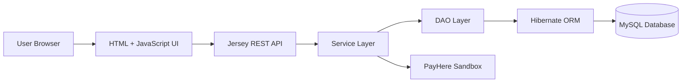
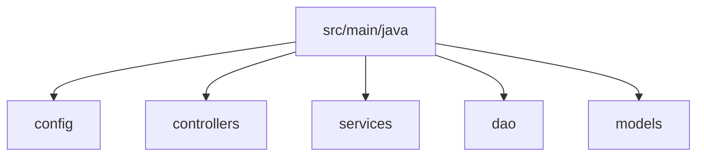
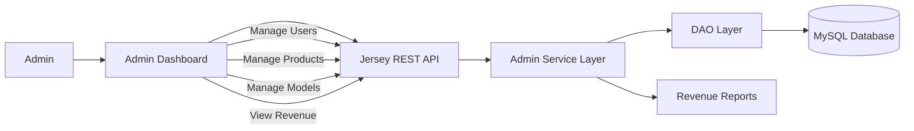
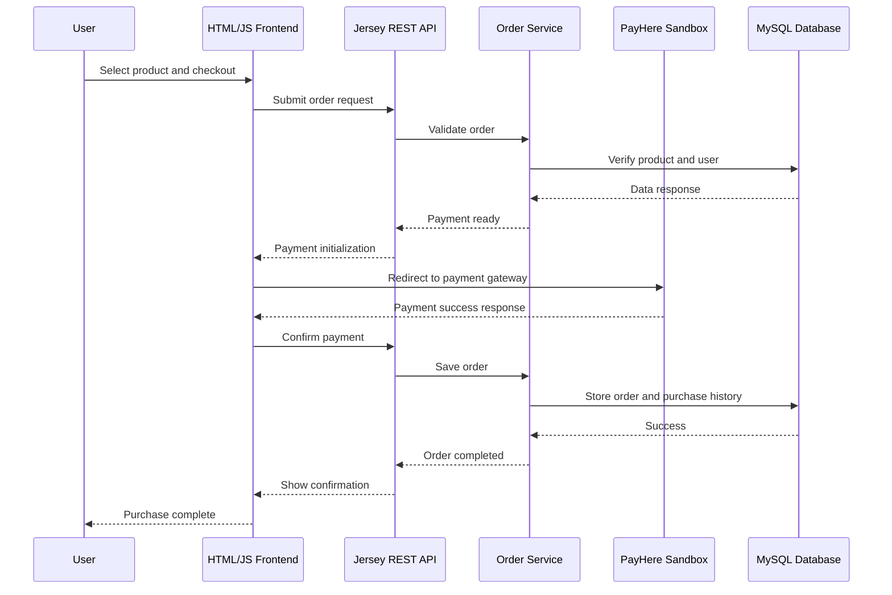
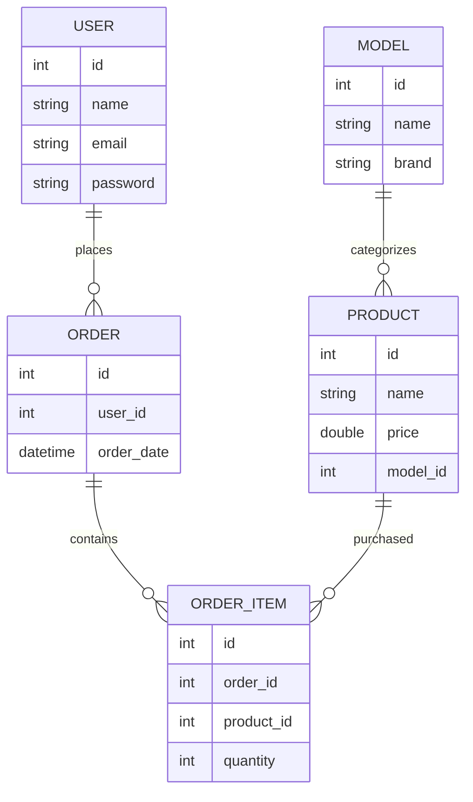

# TimeStore – Jersey + Hibernate Edition


A full-stack **luxury timepiece e-commerce platform** built with **Java, Jersey (JAX-RS), Hibernate, and MySQL**.

The application allows users to browse luxury watches, purchase them online using the **PayHere Sandbox payment gateway**, and manage their purchase history. Administrators can manage users, products, models, and analyze revenue.

---

# Project Overview

TimeStore is a **Java-based web application** following a layered architecture.

The platform integrates:

* **Jersey (JAX-RS)** for RESTful API endpoints
* **Hibernate ORM** for database persistence
* **MySQL** as the relational database
* **HTML + JavaScript** frontend
* **Apache Tomcat** as the application server
* **Maven** for dependency management and builds

Future deployment plans include **Docker containerization**.

---

# System Architecture



---

# Application Features

## User Features

* Browse luxury watch collections
* View detailed product information
* Secure checkout using PayHere sandbox
* View purchase history
* Manage personal account

## Admin Features

* Manage users
* Add, update, and delete products
* Manage watch models
* View total revenue
* View revenue per product
* Monitor platform activity

---

# Technology Stack

| Layer              | Technology        |
| ------------------ | ----------------- |
| Backend            | Java              |
| REST Framework     | Jersey (JAX-RS)   |
| ORM                | Hibernate         |
| Database           | MySQL             |
| Build Tool         | Maven             |
| Application Server | Apache Tomcat     |
| Frontend           | HTML + JavaScript |
| Payment Gateway    | PayHere Sandbox   |

---

# Project Structure



Typical structure:

```
src/main/java
 ├── config
 ├── controllers
 ├── services
 ├── dao
 ├── models
```

---

# Admin Workflow

Administrators manage system operations through an admin dashboard.



---

# Payment Processing Flow

TimeStore integrates **PayHere Sandbox** to simulate secure online payments during development.



---

# Database Entity Relationship



---

# API Documentation

| Method | Endpoint        | Description           |
| ------ | --------------- | --------------------- |
| GET    | /product/load   | Load all products     |
| POST   | /product/add    | Add new product       |
| PUT    | /product/update | Update product        |
| DELETE | /product/delete | Delete product        |
| GET    | /model/load     | Load models           |
| POST   | /model/add      | Add model             |
| POST   | /user/login     | Authenticate user     |
| GET    | /user/history   | View purchase history |

---

# Application Screenshots

Create a folder:

```
docs/images
```

Example structure:

```
docs/images
 ├── homepage.png
 ├── product-page.png
 ├── checkout.png
 └── admin-dashboard.png
```

Then display them in README:

```markdown
### Home Page


### Product Page


### Checkout


### Admin Dashboard

```

---

# Running the Project

## Requirements

* Java 17+
* Maven
* MySQL
* Apache Tomcat

---

## Clone Repository

```
git clone https://github.com/yourusername/timestore-jersey-hibernate.git
```

---

## Configure Database

Create database:

```
CREATE DATABASE timestore;
```

Update database credentials in:

```
hibernate.cfg.xml
```

---

## Build Project

```
mvn clean install
```

## Naming Convention

All variables in Java code should follow lowerCamelCase naming.

Examples:

* productName
* deliveryMethodId
* createdAt

Automated validation runs during Maven `validate` via Checkstyle.

To run only naming validation:

```
mvn checkstyle:check
```

JavaScript variable naming is enforced via ESLint camelCase rules.

To run JavaScript naming validation:

```
npm run lint:naming
```

---

## Deploy to Tomcat

Copy the generated WAR file to:

```
tomcat/webapps/
```

Start Tomcat and open the application in your browser.

---

# Future Improvements

* Docker container deployment
* JWT authentication
* Product search and filtering
* Advanced admin analytics
* Microservice architecture

---

# Related Implementations

This project has another implementation using PHP.

* PHP Version → https://github.com/yourusername/timestore-php
* Java Jersey + Hibernate Version → https://github.com/yourusername/timestore-jersey-hibernate

---

# Author

Developed as a learning project exploring:

* REST API design with Jersey
* ORM persistence with Hibernate
* Java web application architecture
* Payment gateway integration
* E-commerce platform development
