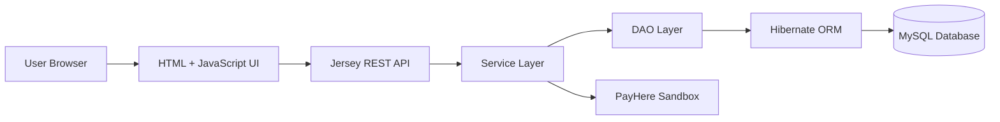
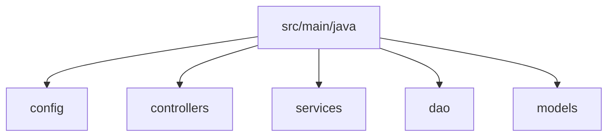
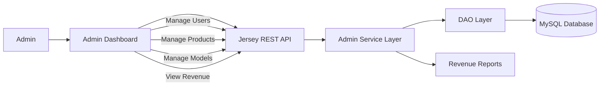
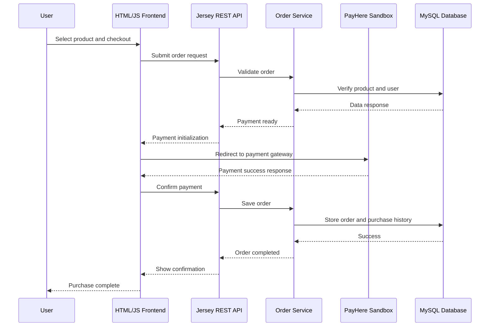
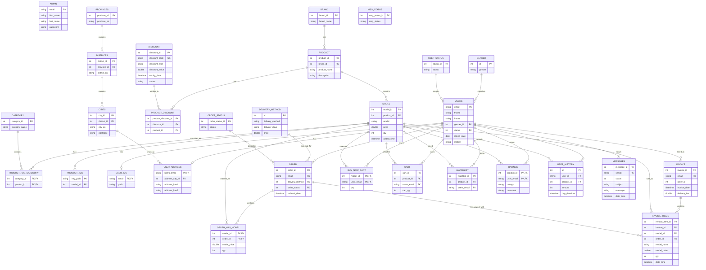

# TimeStore – Jersey + Hibernate Edition


A full-stack **luxury timepiece e-commerce platform** built with **Java, Jersey (JAX-RS), Hibernate, and MySQL**.

The application allows users to browse luxury watches, purchase them online using the **PayHere Sandbox payment gateway**, and manage their purchase history. Administrators can manage users, products, models, and analyze revenue.

---

# Project Overview

TimeStore is a **Java-based web application** following a layered architecture.

The platform integrates:

* **Jersey (JAX-RS)** for RESTful API endpoints
* **Hibernate ORM** for database persistence
* **MySQL** as the relational database
* **HTML + JavaScript** frontend
* **Apache Tomcat** as the application server
* **Maven** for dependency management and builds

Future deployment plans include **Docker containerization**.

---

# System Architecture


```mermaid
flowchart LR

User[User Browser]
Frontend[HTML + JavaScript UI]
API[Jersey REST API]
Service[Service Layer]
DAO[DAO Layer]
Hibernate[Hibernate ORM]
DB[(MySQL Database)]
Payment[PayHere Sandbox]

User --> Frontend
Frontend --> API
API --> Service
Service --> DAO
DAO --> Hibernate
Hibernate --> DB
Service --> Payment
```

---

# Application Features

## User Features

* Browse luxury watch collections
* View detailed product information
* PayHere Sandbox payment integration for checkout testing
* View purchase history
* Manage personal account

## Admin Features

* Manage users
* Add, update, and delete products
* Manage watch models
* View total revenue
* View revenue per product
* Monitor platform activity

---

# Technology Stack

| Layer              | Technology        |
| ------------------ | ----------------- |
| Backend            | Java              |
| REST Framework     | Jersey (JAX-RS)   |
| ORM                | Hibernate         |
| Database           | MySQL             |
| Build Tool         | Maven             |
| Application Server | Apache Tomcat     |
| Frontend           | HTML + JavaScript |
| Payment Gateway    | PayHere Sandbox   |

---

# Project Structure


```mermaid
flowchart TD

src[src/main/java]

config[config]
controllers[controllers]
services[services]
dao[dao]
models[models]

src --> config
src --> controllers
src --> services
src --> dao
src --> models
```

Typical structure:

```
src/main/java
 ├── config
 ├── controllers
 ├── services
 ├── dao
 ├── models
```

---

# Admin Workflow

Administrators manage system operations through an admin dashboard.


```mermaid
flowchart LR

Admin[Admin]
AdminUI[Admin Dashboard]
AdminAPI[Jersey REST API]
AdminService[Admin Service Layer]
AdminDAO[DAO Layer]
DB[(MySQL Database)]
Reports[Revenue Reports]

Admin --> AdminUI
AdminUI --> AdminAPI
AdminAPI --> AdminService
AdminService --> AdminDAO
AdminDAO --> DB
AdminService --> Reports

AdminUI -->|Manage Users| AdminAPI
AdminUI -->|Manage Products| AdminAPI
AdminUI -->|Manage Models| AdminAPI
AdminUI -->|View Revenue| AdminAPI
```

---

# Payment Processing Flow

TimeStore integrates **PayHere Sandbox** to simulate secure online payments during development.


```mermaid
sequenceDiagram

participant User
participant UI as HTML/JS Frontend
participant API as Jersey REST API
participant Service as Order Service
participant PayHere as PayHere Sandbox
participant DB as MySQL Database

User->>UI: Select product and checkout
UI->>API: Submit order request
API->>Service: Validate order
Service->>DB: Verify product and user
DB-->>Service: Data response
Service-->>API: Payment ready
API-->>UI: Payment initialization

UI->>PayHere: Redirect to payment gateway
PayHere-->>UI: Payment success response
UI->>API: Confirm payment
API->>Service: Save order
Service->>DB: Store order and purchase history
DB-->>Service: Success
Service-->>API: Order completed
API-->>UI: Show confirmation
UI-->>User: Purchase complete
```

---

# Database Entity Relationship


```mermaid
erDiagram

ADMIN {
 string email PK
 string first_name
 string last_name
 string password
}

BRAND {
 int brand_id PK
 string brand_name
}

PRODUCT {
 int product_id PK
 int brand_id FK
 string product_name
 string description
}

MODEL {
 int model_id PK
 int product_id FK
 string model
 double price
 int qty
 datetime added_time
}

CATEGORY {
 int category_id PK
 string category_name
}

PRODUCT_HAS_CATEGORY {
 int category_id PK, FK
 int product_id PK, FK
}

PRODUCT_IMG {
 string img_path PK
 int model_id FK
}

DISCOUNT {
 int discount_id PK
 string discount_code UK
 string discount_type
 double discount_value
 datetime expiry_date
 string status
}

PRODUCT_DISCOUNT {
 int product_discount_id PK
 int discount_id FK
 int product_id FK
}

USERS {
 string email PK
 string fname
 string lname
 int gender_id FK
 int status FK
 date joined_date
 string mobile
}

GENDER {
 int id PK
 string gender
}

USER_STATUS {
 int status_id PK
 string status
}

USER_IMG {
 string email PK, FK
 string path
}

USER_ADDRESS {
 string users_email PK, FK
 int address_city_id FK
 string address_line1
 string address_line2
}

PROVINCES {
 int province_id PK
 string province_en
}

DISTRICTS {
 int district_id PK
 int province_id FK
 string district_en
}

CITIES {
 int city_id PK
 int district_id FK
 string city_en
 string postcode
}

DELIVERY_METHOD {
 int id PK
 string delivery_method
 string delivery_days
 double price
}

ORDER_STATUS {
 int order_status_id PK
 string status
}

ORDER {
 int order_id PK
 string email FK
 int delivery_method FK
 int order_status FK
 datetime ordered_date
}

ORDER_HAS_MODEL {
 int model_id PK, FK
 int order_id PK, FK
 double model_price
 int qty
}

INVOICE {
 int invoice_id PK
 string email FK
 int order_id
 datetime invoice_date
 double delivery_fee
}

INVOICE_ITEMS {
 int invoice_item_id PK
 int invoice_id FK
 int model_id FK
 int order_id FK
 string model_name
 double model_price
 int qty
 datetime date_time
}

BUY_NOW_CART {
 int model_id PK, FK
 string user_email PK, FK
 int qty
}

CART {
 int cart_id PK
 int product_id FK
 string users_email FK
 int cart_qty
}

WATCHLIST {
 int watchlist_id PK
 int product_id FK
 string users_email FK
}

RATINGS {
 int product_id PK, FK
 string user_email PK, FK
 string ratings
 string comment
}

USER_HISTORY {
 int id PK
 string user_id FK
 int product_id FK
 int amount
 datetime buy_datetime
}

MESSAGES {
 int message_id PK
 string sender FK
 int status
 string subject
 string message
 datetime date_time
}

MSG_STATUS {
 int msg_status_id PK
 string msg_status
}

BRAND ||--o{ PRODUCT : has
PRODUCT ||--o{ MODEL : contains
MODEL ||--o{ PRODUCT_IMG : has
PRODUCT ||--o{ PRODUCT_DISCOUNT : has
DISCOUNT ||--o{ PRODUCT_DISCOUNT : applies_to
MODEL ||--o{ PRODUCT_HAS_CATEGORY : classified_as
CATEGORY ||--o{ PRODUCT_HAS_CATEGORY : contains

GENDER ||--o{ USERS : classifies
USER_STATUS ||--o{ USERS : assigns
USERS ||--o| USER_IMG : has
USERS ||--o| USER_ADDRESS : has
PROVINCES ||--o{ DISTRICTS : contains
DISTRICTS ||--o{ CITIES : contains
CITIES ||--o{ USER_ADDRESS : used_by

USERS ||--o{ ORDER : places
DELIVERY_METHOD ||--o{ ORDER : selected_for
ORDER_STATUS ||--o{ ORDER : describes
ORDER ||--o{ ORDER_HAS_MODEL : contains
MODEL ||--o{ ORDER_HAS_MODEL : ordered_as
USERS ||--o{ INVOICE : billed_to
INVOICE ||--o{ INVOICE_ITEMS : contains
MODEL ||--o{ INVOICE_ITEMS : sold_as
ORDER ||--o{ INVOICE_ITEMS : associated_with

USERS ||--o{ BUY_NOW_CART : owns
MODEL ||--o{ BUY_NOW_CART : selected
USERS ||--o{ CART : owns
MODEL ||--o{ CART : selected
USERS ||--o{ WATCHLIST : owns
MODEL ||--o{ WATCHLIST : saved
USERS ||--o{ RATINGS : writes
MODEL ||--o{ RATINGS : receives
USERS ||--o{ USER_HISTORY : has
MODEL ||--o{ USER_HISTORY : records
USERS ||--o{ MESSAGES : sends
```

The diagram reflects the foreign keys in `timestore_db.sql`. Some legacy
columns are named `product_id` but reference `model.model_id` in the schema,
including `cart`, `product_has_category`, `ratings`, `user_history`, and
`watchlist`. The `invoice.order_id` and `messages.status` columns are shown as
attributes because the dump does not define foreign-key constraints for them.

---

# API Documentation

| Method | Endpoint        | Description           |
| ------ | --------------- | --------------------- |
| GET    | /product/load   | Load all products     |
| POST   | /product/add    | Add new product       |
| PUT    | /product/update | Update product        |
| DELETE | /product/delete | Delete product        |
| GET    | /model/load     | Load models           |
| POST   | /model/add      | Add model             |
| POST   | /user/login     | Authenticate user     |
| GET    | /user/history   | View purchase history |

## POST `/product/add`

Adds a new product and its first one or more models.

### Request

```http
POST /product/add
Content-Type: application/json
Cookie: JSESSIONID=<authenticated-admin-session>
```

When the application is deployed with the admin context, the full URL is
`/admin/api/product/add`. The frontend calls this endpoint as
`/api/product/add` from the admin application.

#### Authentication

An authenticated admin session is required. Authenticate through the admin
login first and send the resulting `JSESSIONID` cookie with the request. This
endpoint does not use a Bearer token or an `Authorization` header. Requests
without an admin session are redirected to `/admin/signin.html`.

#### Request body

```json
{
	"productName": "Cosmograph Daytona",
	"brandId": 1,
	"models": [
		{
			"model": "126500LN",
			"price": 18500.00,
			"qty": 3
		}
	]
}
```

`brandId` may be replaced with `brandName` to create a new brand. The
`productName` and `models` fields are required.

#### Validation

* The request body must be present.
* Provide either `brandId` or a non-empty `brandName`.
* `productName` must be non-empty.
* `models` must contain at least one item.
* Every model must have a non-empty `model` name.
* Every model must have a `price` greater than `0`.
* Every model must have a `qty` greater than `0`.

#### Responses

**`200 OK` — product created**

```json
{
	"state": true,
	"message": "product added successfully",
	"data": {
		"productId": 101,
		"productName": "Cosmograph Daytona",
		"brandId": 1,
		"brandName": "Rolex"
	},
	"error": ""
}
```

Validation failures also currently return **`200 OK`**, with `state` set to
`false`. For example:

```json
{
	"state": false,
	"message": "at least one model is required",
	"data": null,
	"error": "at least one model is required"
}
```

**`302 Found` — unauthenticated**

Redirects to `/admin/signin.html` when the admin session is missing.

**`500 Internal Server Error` — malformed request or server/database error**

```json
{
	"state": false,
	"message": "Error: <error details>"
}
```

---

# Application Screenshots

## User Pages

### Home Page


### Product Page


### Search Page


### Product Purchase Window


### Checkout Page


### PayHere Payment Window


### PayHere Details


### Payment Success


## Admin Pages

### Admin Dashboard


### Customers


### Orders


### Products


### Messages


### Settings


---

# Running the Project

## Requirements

* Java 17+
* Maven
* MySQL
* Apache Tomcat

---

## Clone Repository

```
git clone https://github.com/ImeshVishmika/timestore-jersey-hibernate
```

---

## Configure Database

Create database:

```
CREATE DATABASE timestore;
```

Update database credentials in:

```
hibernate.cfg.xml
```

---

## Build Project

```
mvn clean install
```

## Naming Convention

All variables in Java code should follow lowerCamelCase naming.

Examples:

* productName
* deliveryMethodId
* createdAt

Automated validation runs during Maven `validate` via Checkstyle.

To run only naming validation:

```
mvn checkstyle:check
```

JavaScript variable naming is enforced via ESLint camelCase rules.

To run JavaScript naming validation:

```
npm run lint:naming
```

---

## Deploy to Tomcat

Copy the generated WAR file to:

```
tomcat/webapps/
```

Start Tomcat and open the application in your browser.


# Related Implementations

This project has another implementation using PHP.

* PHP Version → https://github.com/yourusername/timestore-php
* Java Jersey + Hibernate Version → https://github.com/yourusername/timestore-jersey-hibernate

---

# Author

Developed as a learning project exploring:

* REST API design with Jersey
* ORM persistence with Hibernate
* Java web application architecture
* Payment gateway integration
* E-commerce platform development
