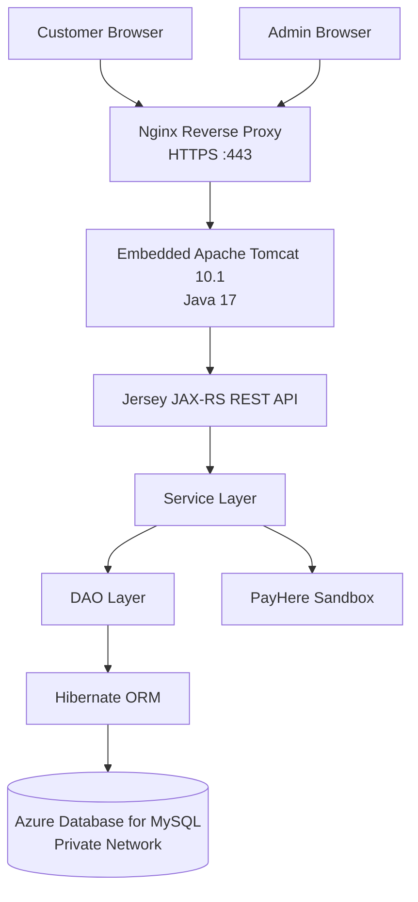

# ⌚ TimeStore – Jersey + Hibernate Edition E-Commerce Platform

**Live Application:** https://timestore.imeshvishmika.me/


TimeStore is a full-stack luxury watch e-commerce platform built with **Java 17, Jersey (JAX-RS), Hibernate ORM, MySQL, HTML, and JavaScript**.

The project started as a Java web application for learning REST APIs, Hibernate, authentication, and e-commerce workflows. It has since evolved into a **deployed cloud application** with an Azure Linux VM, Nginx reverse proxy, HTTPS, systemd service management, private Azure MySQL networking, and automated GitHub Actions deployment.

The goal of the project is not only to build an e-commerce application, but to understand what happens after the code is written: **how an application is built, deployed, secured, connected to a private database, and continuously updated.**

---

## 🌐 Live Application

**[Open TimeStore](https://timestore.imeshvishmika.me/)**

The application is currently deployed on an **Azure Linux VM running Ubuntu**.

The public request path is:

```text
Browser
   │
   │ HTTPS
   ▼
Nginx :443
   │
   │ Reverse Proxy
   ▼
Java / Embedded Tomcat :8080
   │
   ▼
Jersey REST API
   │
   ▼
Service Layer
   │
   ▼
DAO Layer
   │
   ▼
Hibernate ORM
   │
   │ Private VNet connection
   ▼
Azure Database for MySQL
```

The Java application itself listens on port `8080`, while Nginx handles the public HTTP/HTTPS traffic.

---

# 📖 The Story Behind a TimeStore Request

Imagine a customer opens TimeStore and wants to purchase a watch.

This simple action travels through several layers of the system.

## 1. The customer opens TimeStore

The customer visits:

```text
https://timestore.imeshvishmika.me/
```

The browser establishes an HTTPS connection with the Azure VM.

The request first reaches **Nginx**, which acts as the public entry point for the application.

```text
Internet
   │
   │ HTTPS :443
   ▼
Nginx
```

Nginx terminates the public HTTPS connection and forwards application requests internally to:

```text
127.0.0.1:8080
```

The Java application does not need to be directly exposed to the internet.

---

## 2. Nginx forwards the request to Java

Nginx works as a reverse proxy:

```text
Client
   │
   ▼
Nginx :443
   │
   ▼
127.0.0.1:8080
   │
   ▼
Embedded Tomcat
```

The Java application runs using **embedded Apache Tomcat 10.1**.

Instead of requiring a separately installed Tomcat application server, the project packages Tomcat with the application into an executable JAR.

---

## 3. Tomcat passes API requests to Jersey

The application starts two Tomcat web contexts:

```text
Embedded Tomcat
│
├── User application
│   └── /api/*
│       └── Jersey Servlet
│
└── Admin application
    └── /api/*
        └── Jersey Servlet
```

Jersey implements the REST API using JAX-RS.

For example, a request to load products travels through:

```text
GET /api/...
      │
      ▼
Jersey Resource / Controller
```

The controller is responsible for receiving the HTTP request and passing the required operation to the appropriate service.

---

## 4. The Service Layer handles business logic

The request moves from the API layer into the service layer.

```text
Jersey
   │
   ▼
Service
```

The service layer contains application/business logic rather than database-specific operations.

For example, during checkout it can:

* validate the user
* validate the selected products
* check availability
* calculate order information
* coordinate payment
* create the order
* update related records

This separation keeps business logic away from HTTP and database code.

---

## 5. The DAO Layer communicates with the database

When the application needs persistent data, the service layer calls the DAO layer.

```text
Service
   │
   ▼
DAO
   │
   ▼
Hibernate
```

The DAO layer is responsible for database operations.

Hibernate then translates the application's entity operations into SQL/database operations.

---

## 6. Hibernate reaches the private database

This is where the cloud infrastructure becomes important.

The application does **not** connect to a MySQL server running on the VM.

Instead:

```text
Azure VM
   │
   │ Private network
   ▼
Azure Database for MySQL
```

The MySQL Flexible Server is configured with **private networking**.

From the VM, the database hostname resolves through Azure private DNS to a private IP address.

```text
projectdb.mysql.database.azure.com
              │
              ▼
projectdb.privatelink.mysql.database.azure.com
              │
              ▼
          Private IP
```

The database is **not publicly accessible**.

The application connects using TLS:

```text
sslMode=REQUIRED
```

This means the database is isolated from direct public internet access while the application can communicate with it through the Azure private network.

---

# 🏗️ System Architecture


```mermaid
flowchart TD

    User[Customer Browser]
    Admin[Admin Browser]

    Nginx[Nginx Reverse Proxy<br/>HTTPS :443]

    Tomcat[Embedded Apache Tomcat 10.1<br/>Java 17]

    Jersey[Jersey JAX-RS REST API]

    Service[Service Layer]

    DAO[DAO Layer]

    Hibernate[Hibernate ORM]

    MySQL[(Azure Database for MySQL<br/>Private Network)]

    PayHere[PayHere Sandbox]

    User --> Nginx
    Admin --> Nginx

    Nginx --> Tomcat
    Tomcat --> Jersey
    Jersey --> Service
    Service --> DAO
    DAO --> Hibernate
    Hibernate --> MySQL

    Service --> PayHere
```

---

# ☁️ Azure Deployment Architecture

The production application runs on an **Azure Linux VM running Ubuntu**.

The database is hosted separately using **Azure Database for MySQL Flexible Server**.

```text
                         Internet
                            │
                            │ HTTPS
                            ▼
                  ┌───────────────────┐
                  │   Azure Linux VM  │
                  │      Ubuntu       │
                  │                   │
                  │ Nginx :443       │
                  │       │           │
                  │       ▼           │
                  │ Java/Tomcat :8080│
                  │       │           │
                  └───────┼───────────┘
                          │
                          │ Private VNet
                          │
                          ▼
                  ┌───────────────────┐
                  │ Azure MySQL       │
                  │ Flexible Server   │
                  │                   │
                  │ Private Access    │
                  └───────────────────┘
```

### Network principle

The database is deliberately separated from the public internet.

```text
Internet
   │
   ├── HTTPS ──► Nginx
   │
   └── MySQL :3306 ──X──► Database

Azure Private Network
   │
   └── VM ───────────────► MySQL
```

This means the application server can access the database while external clients cannot directly connect to MySQL.

---

# 🚀 Deployment Architecture

The production Java application is packaged as an executable JAR containing the required application dependencies and embedded Tomcat.

The deployment directory is:

```text
/opt/timestore/
│
├── TimeStore-1.0-jar-with-dependencies.jar
│
└── webapp/
    ├── Image/
    ├── views/
    │   ├── User/
    │   └── Admin/
    └── WEB-INF/
```

The application is managed by **systemd**.

```text
Linux
   │
   ▼
systemd
   │
   ▼
TimeStore Java Process
   │
   ▼
Embedded Tomcat :8080
```

This means the application:

* starts automatically with the server
* runs independently of an SSH session
* can be restarted with systemd
* can automatically restart after failure

The service is configured using an external environment file:

```text
/etc/timestore/timestore.env
```

Database credentials are therefore not packaged directly into the JAR.

---

# 🔄 CI/CD Pipeline

TimeStore uses **GitHub Actions** to automatically build and deploy the application.

The deployment flow is:

```text
Developer
    │
    │ git push
    ▼
GitHub
    │
    ▼
GitHub Actions
    │
    ├── Checkout source
    │
    ├── Setup Java 17
    │
    ├── Maven build
    │
    ├── Verify JAR
    │
    ├── Copy JAR to Azure VM
    │
    ├── Copy webapp/
    │
    └── Restart systemd service
    │
    ▼
Azure Linux VM
    │
    ▼
TimeStore running
```

The workflow runs automatically whenever code is pushed to the `main` branch.

### Build

GitHub Actions uses:

```text
Java: 17
Distribution: Eclipse Temurin
Build: Maven
```

The project produces:

```text
target/TimeStore-1.0-jar-with-dependencies.jar
```

The workflow verifies that the JAR exists and is non-empty before deployment.

---

## Deployment to Azure

The workflow securely copies:

```text
TimeStore-1.0-jar-with-dependencies.jar
webapp/
```

to the Azure VM using SSH/SCP.

The deployment script then:

1. validates the uploaded files
2. creates `/opt/timestore`
3. installs the JAR
4. replaces the deployed `webapp/` directory
5. sets ownership
6. restarts the `timestore` systemd service
7. verifies that the service is running

This makes deployment repeatable instead of manually uploading files and restarting the application after every change.

---

# 🔐 Security

Security was considered at both the application and infrastructure levels.

## Application security

The application includes:

* Password hashing using **bcrypt**
* User authentication
* Admin authentication and authorization
* User page authentication filters
* Admin page authentication filters
* Role-based access to administrative functionality

---

## Database security

The production database:

* Uses Azure Database for MySQL Flexible Server
* Uses private networking
* Is not publicly accessible
* Uses TLS for database connections
* Keeps database credentials outside the application JAR

The production JDBC connection uses:

```text
sslMode=REQUIRED
```

Database configuration is supplied through environment variables such as:

```text
MYSQLHOST
MYSQLPORT
MYSQL_DATABASE
MYSQLUSER
MYSQLPASSWORD
```

---

## Network security

The application uses:

```text
Internet
   │
   │ HTTPS :443
   ▼
Nginx
   │
   │ localhost
   ▼
Java :8080
   │
   │ private network
   ▼
MySQL :3306
```

The Java application does not need to expose port `8080` publicly.

---

# 🛒 User Features

Customers can:

* Browse luxury watch collections
* Search for products
* View detailed watch information
* Select watch models/variants
* Register and authenticate
* Manage their account
* Add products to the cart
* Proceed through checkout
* Use the PayHere Sandbox payment flow
* View purchase history

---

# 👨‍💼 Admin Features

Administrators can:

* Authenticate through the admin interface
* Manage users
* Add products
* Update products
* Delete products
* Manage watch models
* View orders
* Monitor platform activity
* View total revenue
* View revenue by product

---

# 💳 Payment Flow

TimeStore integrates the **PayHere Sandbox** for payment testing.

A typical checkout follows this flow:

```text
Customer
   │
   ▼
Select Product
   │
   ▼
Cart / Checkout
   │
   ▼
Jersey API
   │
   ▼
Order Service
   │
   ├──────────────► MySQL
   │
   ▼
PayHere Sandbox
   │
   ▼
Payment Result
   │
   ▼
Jersey API
   │
   ▼
Order + Invoice persistence
   │
   ▼
Customer confirmation
```

The PayHere integration is intended for sandbox/testing purposes.

---

# 🧱 Application Architecture

TimeStore follows a layered architecture.

```text
┌──────────────────────────────┐
│          Frontend            │
│       HTML + JavaScript      │
└──────────────┬───────────────┘
               │
               ▼
┌──────────────────────────────┐
│       Jersey / JAX-RS        │
│       REST API Layer         │
└──────────────┬───────────────┘
               │
               ▼
┌──────────────────────────────┐
│        Service Layer         │
│      Business Logic          │
└──────────────┬───────────────┘
               │
               ▼
┌──────────────────────────────┐
│          DAO Layer           │
│     Database Operations      │
└──────────────┬───────────────┘
               │
               ▼
┌──────────────────────────────┐
│       Hibernate ORM          │
│   Object / Relational Map    │
└──────────────┬───────────────┘
               │
               ▼
┌──────────────────────────────┐
│           MySQL              │
└──────────────────────────────┘
```

This separation makes it easier to keep HTTP handling, business logic, and persistence responsibilities independent.

---

# 📁 Project Structure

The main Java application is organized around configuration, API/controllers, services, data access, and models.

```text
src/
└── main/
    ├── java/
    │   └── com/org/
    │       ├── config/
    │       ├── controller/
    │       ├── service/
    │       ├── dao/
    │       ├── model/
    │       ├── filter/
    │       ├── util/
    │       └── Main.java
    │
    └── resources/
```

The frontend/deployed web resources are located under:

```text
webapp/
├── Image/
├── views/
│   ├── User/
│   └── Admin/
└── WEB-INF/
```

---

# 🗄️ Database

MySQL stores the application's users, products, models, carts, orders, invoices, and related information.

The application uses Hibernate ORM to map Java entities to relational database tables.

The production database is hosted separately from the application server:

```text
Azure VM
    │
    │ Private connection
    ▼
Azure MySQL Flexible Server
```

This separation means the application server and database server can be managed independently.

---

# 🛠️ Technology Stack

| Area               | Technology                               |
| ------------------ | ---------------------------------------- |
| Language           | Java 17                                  |
| REST API           | Jersey / JAX-RS                          |
| ORM                | Hibernate ORM                            |
| Database           | MySQL 8.x                                |
| Database Hosting   | Azure Database for MySQL Flexible Server |
| Application Server | Embedded Apache Tomcat 10.1              |
| Frontend           | HTML + JavaScript                        |
| Payment            | PayHere Sandbox                          |
| Build              | Maven                                    |
| CI/CD              | GitHub Actions                           |
| Production OS      | Ubuntu Linux                             |
| Cloud              | Microsoft Azure                          |
| Reverse Proxy      | Nginx                                    |
| Process Management | systemd                                  |
| HTTPS              | Nginx + TLS                              |
| Networking         | Azure VNet / Private MySQL access        |
| Containerization   | Docker configuration included            |

---

# 🧪 Development Setup

## Requirements

For local development:

* JDK 17
* Maven
* MySQL
* Git
* IntelliJ IDEA or another Java IDE

The production environment does not require Maven because the application is deployed as a pre-built executable JAR.

---

## Clone the repository

```bash
git clone https://github.com/ImeshVishmika/timestore-jersey-hibernate.git
cd timestore-jersey-hibernate
```

---

## Configure the database

For local development, configure the database connection using the project's local Hibernate configuration.

Create a MySQL database:

```sql
CREATE DATABASE timestore_db;
```

Then configure the local database credentials in the appropriate Hibernate configuration.

For production, database credentials are supplied through environment variables rather than committed to the repository.

---

# 🔨 Build

Run:

```bash
mvn clean package
```

The executable application JAR is generated as:

```text
target/TimeStore-1.0-jar-with-dependencies.jar
```

To run the packaged application locally:

```bash
java -jar target/TimeStore-1.0-jar-with-dependencies.jar
```

The application listens on port `8080` by default.

A `PORT` environment variable can be used when a different port is required.

---

# 🧹 Code Quality

The project includes Checkstyle configuration for Java naming conventions.

Java variables follow `lowerCamelCase`.

Examples:

```java
productName
deliveryMethodId
createdAt
```

Run Checkstyle with:

```bash
mvn checkstyle:check
```

JavaScript naming conventions are also validated using ESLint.

```bash
npm run lint:naming
```

---

# 🐳 Docker

A Dockerfile is included in the repository for containerized deployment and experimentation.

The current Azure production deployment, however, uses:

```text
Executable JAR
+
Embedded Tomcat
+
systemd
+
Nginx
```

The Docker configuration provides an additional deployment option without making the production environment dependent on Docker.

---

# 📡 API

The application exposes REST endpoints through Jersey.

Examples include:

| Method   | Endpoint          | Purpose                   |
| -------- | ----------------- | ------------------------- |
| `GET`    | `/product/load`   | Load products             |
| `POST`   | `/product/add`    | Add product               |
| `PUT`    | `/product/update` | Update product            |
| `DELETE` | `/product/delete` | Delete product            |
| `GET`    | `/model/load`     | Load models               |
| `POST`   | `/model/add`      | Add model                 |
| `POST`   | `/user/login`     | Authenticate user         |
| `GET`    | `/user/history`   | Retrieve purchase history |

The exact endpoint paths and available operations are implemented in the Jersey resource/controller classes.

---

# 🔄 From Code Change to Production

The complete development-to-production journey looks like this:

```text
Developer changes Java code
          │
          ▼
       git push
          │
          ▼
      GitHub main
          │
          ▼
    GitHub Actions
          │
          ├── Checkout
          │
          ├── Java 17
          │
          ├── Maven build
          │
          └── Verify JAR
          │
          ▼
     SCP deployment
          │
          ▼
      Azure VM
          │
          ├── Update JAR
          │
          ├── Update webapp/
          │
          └── Restart systemd
          │
          ▼
       Nginx
          │
          ▼
       HTTPS
          │
          ▼
   TimeStore application
          │
          ▼
   Private Azure MySQL
```

This allows the application to move from a source-code change to a running production deployment without manually rebuilding and uploading the application.

---

# 📸 Application Screenshots

## User Interface

### Home Page


### Product Page


### Search


### Checkout


### PayHere Payment


### Payment Success


## Admin Interface

### Admin Dashboard


### Customers


### Orders


### Products


---

# 🔐 Production Configuration

Production configuration is kept outside the source code.

The systemd service loads:

```text
/etc/timestore/timestore.env
```

The application receives database configuration through environment variables such as:

```text
MYSQLHOST
MYSQLPORT
MYSQL_DATABASE
MYSQLUSER
MYSQLPASSWORD
```

This prevents production database credentials from being embedded in the Git repository or executable JAR.

---

# 📌 Why This Project Exists

TimeStore started as a way to learn Java web development and gradually became a practical exercise in understanding the complete software lifecycle.

The project covers several stages:

```text
Java programming
      ↓
REST API development
      ↓
Layered architecture
      ↓
Hibernate persistence
      ↓
Authentication
      ↓
E-commerce workflows
      ↓
Payment integration
      ↓
Linux deployment
      ↓
Reverse proxy
      ↓
HTTPS
      ↓
Cloud hosting
      ↓
Private database networking
      ↓
CI/CD automation
```

The project therefore focuses not only on writing application code, but also on understanding how that code behaves in a real deployment environment.

---

# 🚧 Future Improvements

Potential future improvements include:

* Replace Hibernate's built-in connection pool with HikariCP
* Add automated unit and integration testing
* Add a dedicated health-check endpoint
* Improve application monitoring and centralized logging
* Implement automated database backups and recovery testing
* Expand CI/CD with automated tests before deployment
* Improve API documentation
* Add stronger production observability
* Further harden Azure network security

---

# 🔗 Related Projects

TimeStore also has a separate PHP implementation:

**PHP Edition:**
https://github.com/ImeshVishmika/timestore-php

The two implementations explore the same e-commerce domain using different backend technologies.

---

# 👨‍💻 Author

**Imesh Vishmika**

Software Engineering Undergraduate

GitHub:
https://github.com/ImeshVishmika

---

## ⭐ Project Focus

TimeStore demonstrates practical experience with:

* Java backend development
* REST API design
* Jersey / JAX-RS
* Hibernate ORM
* Relational database design
* Authentication and authorization
* E-commerce workflows
* Payment gateway integration
* Linux server administration
* Nginx reverse proxy configuration
* HTTPS/TLS
* Azure cloud deployment
* Private cloud networking
* systemd service management
* GitHub Actions CI/CD
* Maven build automation
* Production configuration management
* Docker-based deployment options

